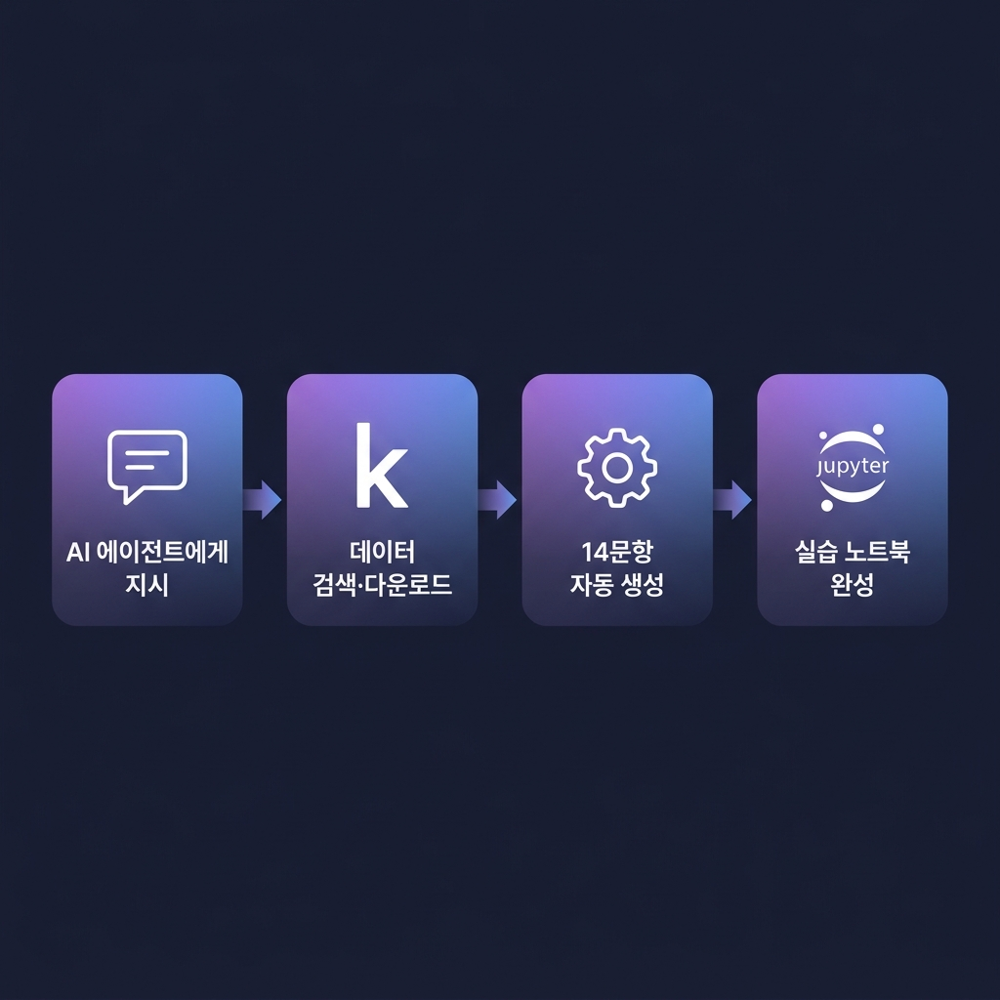
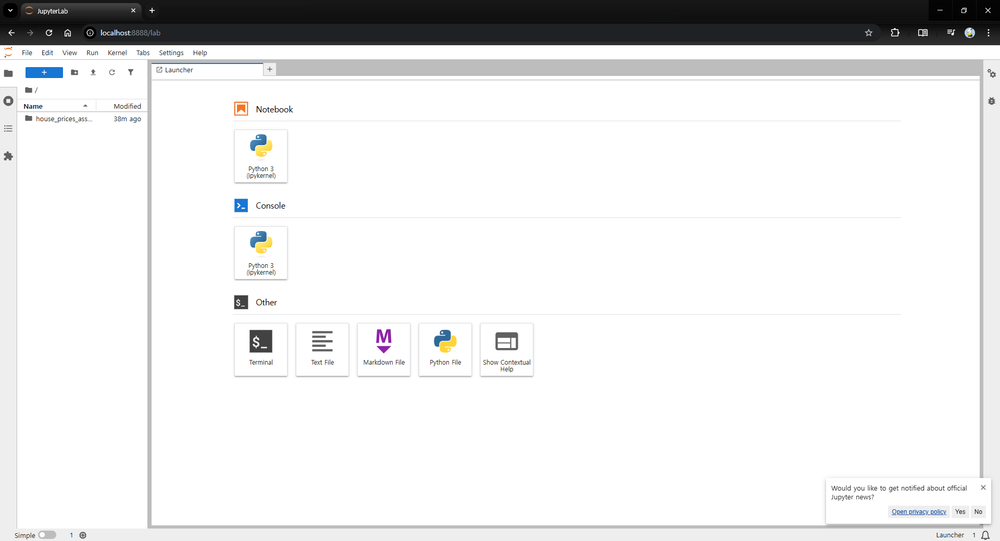

# 🎓 AICE Associate 실습 환경

> **Kaggle 데이터셋을 활용해 AICE Associate 스타일 14문항 모의시험 노트북을 자동 생성하는 실습 환경입니다.**

AI 에이전트에게 Kaggle 대회 이름만 알려주면, 데이터 분석 → 전처리 → 모델링까지 구성된 실습 노트북(`.ipynb`)과 참고용 모범답안이 한 번에 만들어집니다.



---

## 👋 이런 분들에게 추천합니다

| 대상 | 이 환경을 쓰면 좋은 이유 |
|------|--------------------------|
| 🎯 **AICE Associate 수험생** | 실제 시험과 동일한 **14문항 / 90분** 구성으로 실전 감각을 키울 수 있습니다 |
| 🐍 **Python·ML 입문자** | Kaggle 데이터로 **데이터 분석 → 전처리 → 모델링**의 전체 흐름을 체득합니다 |
| 👨‍🏫 **AI 교육 강사** | 대회 이름만 바꿔 즉시 새 실습 자료를 생성할 수 있어 강의 준비 시간을 줄입니다 |
| 🔄 **반복 학습이 필요한 분** | 다양한 데이터셋으로 같은 형식의 문제를 무한히 생성해 패턴을 학습합니다 |

> [!NOTE]
> 코딩 경험이 없어도 괜찮습니다. Docker만 설치하면 아래 가이드를 따라 **5분 안에** 실습 환경이 준비됩니다.

---

## 📋 목차

1. [사전 준비](#-사전-준비)
2. [빠른 시작 (5분)](#-빠른-시작-5분)
3. [실습 노트북 만들기](#-실습-노트북-만들기)
4. [사용 예시 모음](#-사용-예시-모음)
5. [프로젝트 구조](#-프로젝트-구조)
6. [환경 종료 및 재시작](#-환경-종료-및-재시작)
7. [참고 자료](#-참고-자료)

---

## 🔧 사전 준비

시작하기 전에 아래 두 가지가 설치되어 있는지 확인하세요.

| 필요 항목 | 확인 방법 | 설치 안내 |
|-----------|-----------|-----------|
| **Docker Desktop** | `docker --version` | [docker.com/get-docker](https://www.docker.com/get-docker) |
| **Docker Compose** | `docker compose version` | Docker Desktop에 기본 포함 |

> [!TIP]
> Windows 사용자라면 Docker Desktop 설치 시 WSL 2 백엔드가 자동으로 활성화됩니다. 설치 후 Docker Desktop을 실행해 두세요.

### Kaggle MCP 설정 (선택)

AI 에이전트가 Kaggle에서 직접 데이터를 검색하고 다운로드하려면 **Kaggle MCP** 연결이 필요합니다.

1. [Kaggle 계정](https://www.kaggle.com)에 로그인합니다.
2. **Settings → API → Create New Token**으로 `kaggle.json`을 다운로드합니다.
3. [Kaggle MCP 설정 가이드](https://www.kaggle.com/docs/mcp)를 따라 연결합니다.

> [!NOTE]
> Kaggle MCP가 없어도 Docker 환경 자체는 정상 작동합니다. 다만, 에이전트를 통한 자동 데이터셋 조회·다운로드 기능이 제한됩니다.

---

## 🚀 빠른 시작 (5분)

### 1단계: 저장소 클론

```bash
git clone <이 저장소 URL>
cd aice-study
```

### 2단계: notebooks 폴더 확인

`notebooks/` 폴더가 이미 있는지 확인합니다. 없다면 생성하세요.

```bash
mkdir notebooks
```

### 3단계: Docker 환경 실행

```bash
docker compose up --build
```

첫 실행 시 Python 패키지 설치로 **3~5분** 정도 걸립니다. 아래 메시지가 보이면 준비 완료입니다.

```
Jupyter Server is running at:
http://0.0.0.0:8888/lab
```

### 4단계: Jupyter Lab 접속

브라우저에서 아래 주소를 열면 바로 사용할 수 있습니다.

```
http://localhost:8888
```

> [!IMPORTANT]
> 비밀번호나 토큰 없이 바로 접속됩니다. 로컬 개발 전용이므로 외부 네트워크에 노출하지 마세요.

### ✅ 잘 되었는지 확인하기

아래와 같은 JupyterLab 화면이 열리면 성공입니다.



왼쪽 파일 탐색기에 빈 디렉터리가 보이면 정상입니다.  
노트북에서 아래 코드를 실행해 라이브러리가 정상 설치되었는지 테스트하세요.

```python
import numpy, pandas, matplotlib, seaborn, sklearn, tensorflow, xgboost
print("모든 라이브러리가 정상 로드되었습니다! ✅")
```

---

## 📓 실습 노트북 만들기

이 프로젝트에는 `kaggle-aice-associate-builder`라는 AI 스킬이 내장되어 있습니다.  
AI 에이전트에게 **스킬 이름 + Kaggle 데이터셋**을 포함해 지시하면 됩니다.

### 사용 형식

```
$kaggle-aice-associate-builder <Kaggle 대회 또는 데이터셋 이름> <원하는 요청>
```

### AICE Associate 시험 상세

| 항목 | 상세 내용 |
|------|-----------|
| **검정 역량** | AI 학습 프로세스를 이해하고, 비즈니스 데이터를 분석하여 AI 모델로 문제를 해결하는 역량 |
| **평가 방식** | **100% 실기 평가** (Python 활용, 제한적 오픈북) |
| **문항/시간** | **14문항 / 90분** |
| **합격 기준** | **80점 이상** (100점 만점) |
| **응시료** | ￦ 80,000 (VAT 포함) |
| **유효기간** | 자격 취득일로부터 3년 |

### 출제 범위 및 배점

| 분야 | 상세 내용 | 문항 수 | 배점 |
|------|-----------|---------|------|
| **데이터 분석** | 라이브러리 설치, 데이터 특성 파악, 품질 점검 및 시각화 | 5~6문항 | 30점 |
| **데이터 전처리** | 결측치/이상치 처리, 스케일링, 인코딩, 데이터셋 분할 | 4~5문항 | 30점 |
| **AI 모델링** | ML/DL 모델 학습, 성능 평가 및 시뮬레이션, 성능 개선 | 4~5문항 | 40점 |

> [!TIP]
> 모든 문제는 **Tabular Data**를 기반으로 출제됩니다.

### 문제 유형 (4가지)

### 결과로 생성되는 파일

```
notebooks/
└── <대회명>/
    ├── data/
    │   ├── raw/          ← 원본 데이터 (train.csv, test.csv 등)
    │   └── submissions/  ← 제출 파일 저장 위치
    ├── problem.ipynb              ← 문제지 (빈 코드 셀, 오류 코드, 빈칸)
    └── solution.ipynb             ← 정답 코드, 해설, 예상 출력

```

> [!NOTE]
> **문제지**에는 정답·실행결과가 없습니다. 실제 시험처럼 풀어본 뒤 **모범답안** 노트북으로 채점하세요.

---

## 💡 사용 예시 모음

> [!NOTE]
> 아래에 명시하지 않아도 **기본으로 포함**되는 항목:
> - 폴더 구조 (`data/raw/`, `data/submissions/`)
> - 한국어 작성
>
> 상세 기본값은 `SKILL.md`를 참고하세요.


### 1. 가장 기본적인 사용법

Kaggle 대회 이름만 지정하면 기본 14문항 노트북이 생성됩니다.

```text
$kaggle-aice-associate-builder
titanic 데이터를 기준으로
AICE Associate 스타일 14문항 노트북을 만들어줘.
```

### 2. 회귀 문제 지정

문제 유형을 명시하면 더 적합한 문항이 구성됩니다.

```text
$kaggle-aice-associate-builder
house-prices-advanced-regression-techniques 대회를 기준으로
회귀 문제 실습 세트를 만들어줘.
```

### 3. 분류 문제 지정

```text
$kaggle-aice-associate-builder
heart-disease-uci 데이터셋으로
분류 문제용 노트북을 만들어줘.
```

### 4. 구성안 초안만 먼저 확인

바로 노트북을 만들지 않고, 데이터 구조를 확인한 뒤 구성안만 먼저 받아볼 수 있습니다.

```text
$kaggle-aice-associate-builder
먼저 Kaggle 데이터 구조를 조사하고,
그 결과를 바탕으로 14문항 구성안만 초안으로 보여줘.
```

### 5. 제출 파일까지 명시 요청

기본 동작에도 포함되지만, submission 형식을 강조하고 싶을 때:

```text
$kaggle-aice-associate-builder
bike-sharing-demand 데이터를 기준으로
회귀 문제 실습 세트를 만들고,
마지막에 submission.csv 예시까지 생성해줘.
```

> [!TIP]
> **지시를 더 정확하게 쓰는 팁**
> - **분류 / 회귀** 중 하나를 명시하면 문항 구성이 더 정확해집니다.
> - 영어 노트북이 필요하면 `영어로 작성해줘`를 추가하세요 (기본값: 한국어).
> - 특정 산출물만 원하면 명시하세요: 예) `구성안만`, `submission.csv까지`

---

## 📁 프로젝트 구조

```
aice-study/
├── 📄 README.md              ← 지금 보고 있는 문서
├── 📄 SKILL.md               ← AI 스킬 정의 (kaggle-aice-associate-builder)
├── 📄 AGENT.md               ← AI 에이전트 기본 설정
├── 📄 requirements.txt       ← Python 패키지 목록
├── 📄 docker-compose.yml     ← Docker 서비스 정의
│
├── 📂 assets/                ← 문서용 이미지
├── 📂 docker/jupyter/
│   └── Dockerfile            ← Jupyter 환경 빌드 설정
│
├── 📂 notebooks/             ← 실습 노트북 저장 (컨테이너와 공유)
│
├── 📂 agents/
│   └── openai.yaml           ← 에이전트 인터페이스 정의
│
└── 📂 references/
    └── aice-associate-blueprint.md  ← 14문항 출제 기준 가이드
```

### 포함된 Python 라이브러리

| 라이브러리 | 용도 |
|-----------|------|
| `numpy` | 수치 연산 |
| `pandas` | 데이터 조작 |
| `matplotlib` | 시각화 |
| `seaborn` | 통계 시각화 |
| `scikit-learn` | 머신러닝 |
| `tensorflow` | 딥러닝 (CPU) |
| `xgboost` | 그래디언트 부스팅 |

> [!NOTE]
> 기본 환경은 **Python 3.11 + CPU** 기반입니다. GPU가 필요한 경우 `Dockerfile`을 수정하세요.

---

## 🔄 환경 종료 및 재시작

### 환경 종료

```bash
docker compose down
```

### 다시 시작 (이미지 재빌드 없이)

```bash
docker compose up
```

### 설정 변경 후 재빌드가 필요할 때

`requirements.txt`나 `Dockerfile`을 수정한 후에는 이미지를 다시 빌드해야 합니다.

```bash
docker compose up --build
```

---

## 📚 참고 자료

- [AICE Associate 시험 안내](https://aice.study/) — 시험 구성 및 응시 방법
- [AICE Associate 소개](https://aice.study/info/aice/asso) — 시험 과목·출제 범위·합격 기준 상세
- [Kaggle MCP 설정 가이드](https://www.kaggle.com/docs/mcp) — AI 에이전트용 Kaggle 연결 설정
- [Docker Desktop 설치](https://www.docker.com/get-docker) — Docker 환경 구축
- [JupyterLab 사용법](https://jupyterlab.readthedocs.io/) — Jupyter Lab 기본 가이드

---
